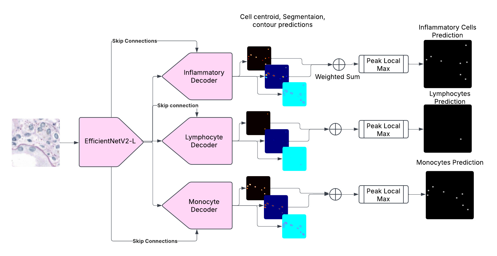

# Monkey_TIAKong
GitHub Repostory for TIAKong Algorithm for the [MONKEY challenge](https://monkey.grand-challenge.org/).  

# Description
Training and prediction pipeline for mononuclear leukocytes (MNLs) detection.  
Class 1: Overall MNLs  
Class 2: Lymphocytes  
Class 3: Monocytes

# Model
Multi-head Model consisting of an EfficientNetV2_L encoder and 3 decoders each specialised in detecting one class of cells.  
Each decoder outputs three maps: Cell Centroids, cell Segmentation, and cell contours map.  

# Training
Training script: `train_multiclass_detection.py`  
## Data Preparation  
Extract patches of size 256x256 px at 40x power from Monkey Dataset.  
For each patch, there are 3 ground truth masks:  
- **Nuclei centroid mask**: nuclei Centroids are dilated with a diameter of 11 px.  
- **Nuclei segmentation mask**: use the publicly available `NuClick` (PanNuke) model from [TIAToolBox](https://github.com/TissueImageAnalytics/tiatoolbox) to perform interactive nuclei segmentation to obtain nuclei segmentation masks for each patch.  
- **Nuclei contour mask**: apply Sobel filters on nuclei segmentation masks to obtain nuclei contour masks.

## Loss Functions
Centroid prediction: Jaccard + Dice + Focal  
Segmentation prediction: BCE + Dice  
Contour prediction: BCE + Dice  
Loss from 3 decoders are combined using `AutomaticWeightedLoss` [src](https://github.com/Mikoto10032/AutomaticWeightedLoss).

## Training parameters
Batch Size = 48  
Inital Learning rate = 0.0004  
Optimizer = AdamW  
Weight Decay = 0.005  
Scheduler = CosineAnnealingWarmRestarts  
Early stop is used  

# WSI Inference Pipeline  
`inference-docker/inference_multiclass_detection.py`  
## Inference Process  
<ol>
<li>Extract 2048x2048px tiles from WSI at 40x power within the ROI
<li>For each tile, extract 256x256px patches with a stride of 224px. Predict on each patch. 
<li> Merge patch predictions, resolve overlaps by averaging. 
<li> Convert centroids prediction maps to coordinates using peak local max with a threshold of 0.5. Repeat for all tiles
<li> Perform non-maximum suppression 
<ol>
